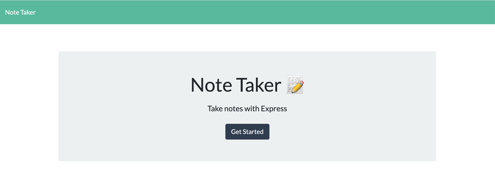
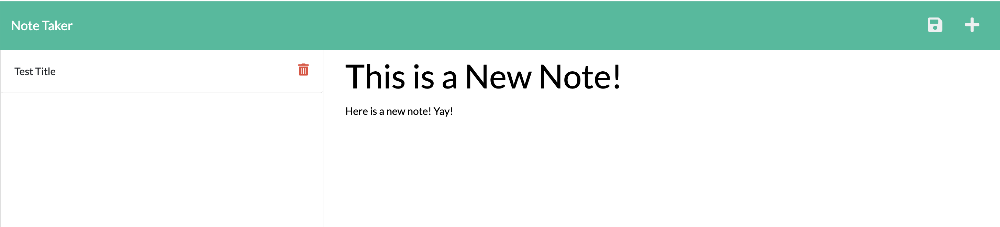
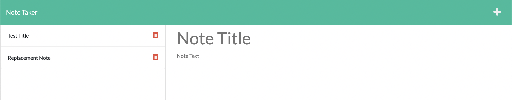

# My Notetaker App

## Table of contents

- [Description](#description)
- [Installation Instructions](#installation)
- [Screenshots](#screenshots)
- [Links](#links)
- [Contact Info](#contact)
- [Copyright and license](#copyright-and-license)

## Description

This is a note-taking application that lets a user input, save, and delete notes in a web browser. Notes are stored in a local database.

## Installation Instructions

This application is deployed in Heroku and can be accessed using the link below.

To run locally, clone this repository, open a terminal and navigate to the repository folder. Then type the following:

```
$ npm i
$ node server.js
```

The application will start and state that it is listening on port 8080. You can then navigate to 127.0.0.1:8080 and run locally.

## Screenshots

Main Page On Initial Load



Starting Note Page



After Saving a Note


After Adding Another Note then Deleting a Note



## Links

[Link to Heroku App](https://jenni-notetaker-app.herokuapp.com/)

[Link to Github Repository](https://github.com/jenniwritescode/my-notetaker-app)

## Contact Info

[Email](mailto:jenni.hartman@icloud.com)

[LinkedIn](https://linkedin.com/in/jennihartman)

## Copyright and License

Copyright (C) Jenni Hartman 2022

[](https://www.gnu.org/licenses/agpl-3.0)

This program is free software: you can redistribute it and/or modify it under the terms of the GNU Affero General Public License as published by the Free Software Foundation, either version 3 of the License, or (at your option) any later version.
This program is distributed in the hope that it will be useful, but WITHOUT ANY WARRANTY; without even the implied warranty of MERCHANTABILITY or FITNESS FOR A PARTICULAR PURPOSE.  See the [GNU Affero General Public License](https://www.gnu.org/licenses/agpl-3.0) for more details.
